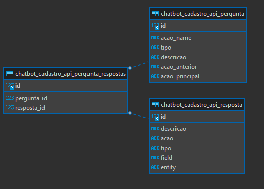
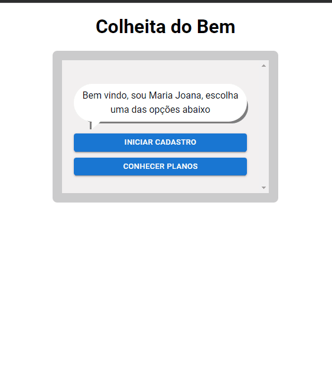

## Chatbot

### Projeto de chatbot utilizando python e reactjs

<br/>
<p>Criamos nossa api backend utilizando Django e python, com dois bancos Sqlite para cadastrar nossas perguntas e respostas, e banco de dados MongoDb para
cadastrar o cadastro realizado via chatbot, optamos em utilizado um banco de dados relacional assim dando a liberdade em cadastrar n questões no banco de dado relacional e isso pode ser salvo em um banco de dados em forma de documento</p>

Exemplo do documento:
```js
{
  "_id": {
    "$oid": "6360478fb426d7bb3bbfb9f3"
  },
  "data": {
    "cpf": "1234",
    "nome": "4321",
    "email": "teste@teste.com.br"
  },
  "entity": "usuario",
  "created_at": {
    "$date": {
      "$numberLong": "1667243359379"
    }
  },
  "updated_at": {
    "$date": {
      "$numberLong": "1667243373278"
    }
  }
}
```

O atributo Data fical Flexivel, baseado nas perguntas cadastradas no banco de dados.


## Banco de dados relacional




## Demonstração da Aplicação




